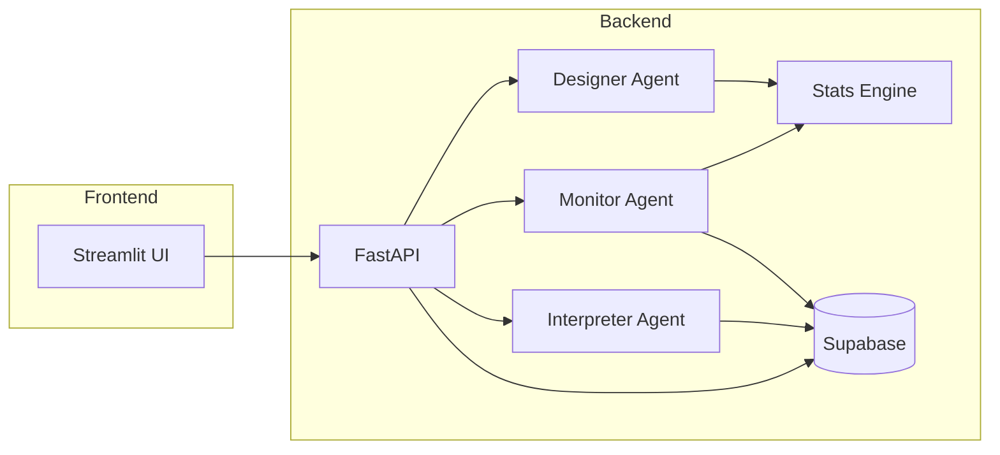
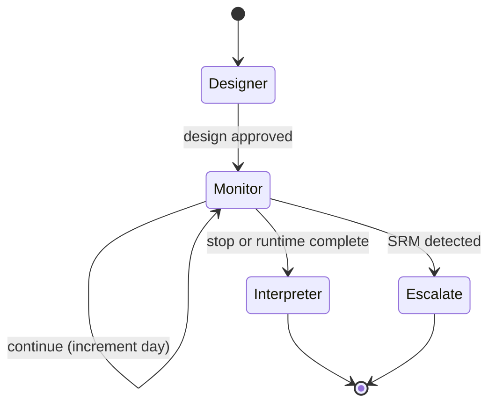
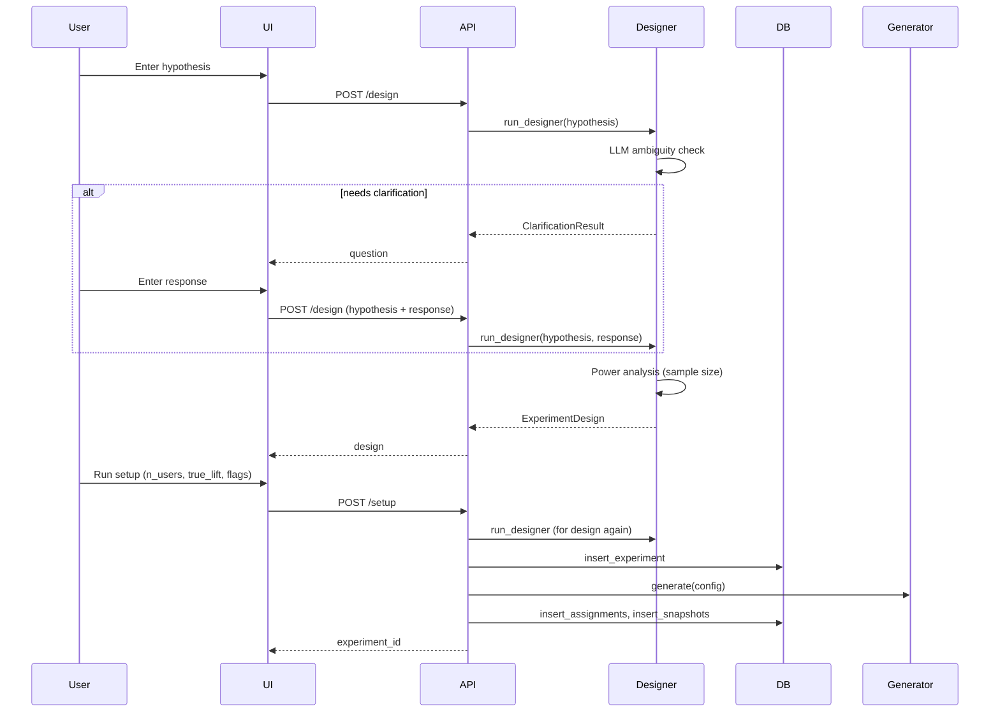
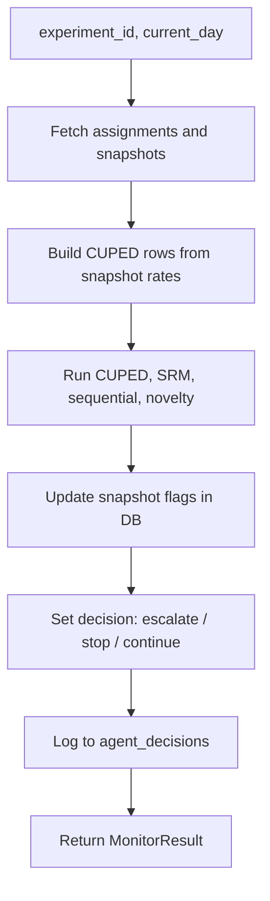

# Growth Experimentation Copilot

A production-oriented agentic system for designing, monitoring, and interpreting A/B experiments using natural language. The statistics layer is implemented from first principles, agent routing is conditional (LangGraph), and the LLM is used for reasoning and synthesis, not only text generation.

---

## Overview

Product and growth teams describe an experiment idea in plain language. The system produces a structured design (metrics, sample size, runtime), can generate synthetic data with configurable ground truth (lift, SRM, novelty), run daily monitoring with CUPED, SRM detection, sequential testing, and novelty checks, and finally output a plain-English recommendation with a suggested action (ship, iterate, abandon, rerun). All agent decisions are persisted for auditability.

**Design principles:**

- **Statistics from scratch:** CUPED (OLS covariate adjustment), SRM (chi-square), O'Brien-Fleming sequential boundaries, and novelty detection are implemented with NumPy/SciPy only where necessary (e.g. CDF for p-values). No black-box experiment libraries.
- **Conditional orchestration:** The monitor decides whether to continue, escalate (e.g. SRM), or stop; the graph branches accordingly. No fixed linear pipeline.
- **LLM for reasoning:** Hypothesis clarification, design extraction, and final recommendation use GPT-4o mini for inference and structured output, not as a generic chatbot.
- **Full audit trail:** Every monitor and interpreter decision is written to `agent_decisions` with reasoning.

---

## Tech Stack

| Layer         | Technology                                |
|--------------|-------------------------------------------|
| Frontend     | Streamlit                                 |
| Backend API  | FastAPI                                   |
| Orchestration | LangGraph (StateGraph, conditional edges) |
| LLM          | OpenAI GPT-4o mini                        |
| Database     | Supabase (PostgreSQL)                     |
| Language     | Python 3.13                               |

---

## Project Structure

```
.
├── backend/
│   ├── agents/
│   │   ├── designer.py      # Experiment Designer: hypothesis -> design (with optional clarification)
│   │   ├── monitor.py       # Monitor: one-day stats (CUPED, SRM, sequential, novelty) and decision
│   │   └── interpreter.py   # Results Interpreter: snapshots + decisions -> recommendation and action
│   ├── graph/
│   │   └── orchestrator.py  # LangGraph state, nodes (stubs), and conditional routing
│   ├── stats/
│   │   ├── cuped.py         # CUPED variance reduction (OLS + two-sample t-test)
│   │   ├── srm.py           # Sample ratio mismatch (chi-square goodness-of-fit)
│   │   ├── sequential.py    # O'Brien-Fleming alpha-spending boundaries
│   │   └── novelty.py       # Early-window vs overall lift ratio
│   ├── data/
│   │   └── generator.py     # Synthetic B2C SaaS events and assignments (configurable SRM/novelty)
│   ├── db/
│   │   └── supabase_client.py # Supabase client singleton, CRUD for experiments/snapshots/decisions
│   ├── config.py            # Env and constants (alpha, power, runtime limits, etc.)
│   └── main.py              # FastAPI app and endpoints
├── frontend/
│   └── app.py               # Streamlit UI: New Experiment, Monitor, Interpret, Experiment History
├── .gitignore
└── README.md
```

### Module roles

- **backend/agents/designer.py**
  Accepts a hypothesis string and optional clarification response. Uses GPT-4o mini to detect ambiguity (primary metric, randomization unit) and, if needed, returns one clarifying question. Otherwise returns a structured design (primary_metric, guardrail_metrics, randomization_unit, runtime_days, warnings). Sample size is computed via a two-proportion z-test power formula (NumPy); no statsmodels. Adds a warning when the hypothesis mentions marketplace or two-sided platforms (SUTVA risk).

- **backend/agents/monitor.py**
  For a given experiment and day: loads assignments and snapshots from Supabase, builds per-user rows for CUPED (using current-day snapshot rate as metric proxy when raw events are not stored), runs CUPED, SRM (assignment counts), sequential (O'Brien-Fleming with current-day means/stds), and novelty (all snapshots through that day). Writes `srm_flagged` and `novelty_flagged` back to that day's snapshot rows, logs one row to `agent_decisions` (agent=monitor, decision=continue|escalate|stop, reasoning). Returns a MonitorResult (all result dicts plus decision and reasoning). Converts NumPy types to native Python for JSON.

- **backend/agents/interpreter.py**
  Loads assignments and agent decisions from Supabase; receives all snapshots from the caller (API fetches them). Computes final CUPED (aggregate rate per variant across all days), final SRM (total assignment counts), and final novelty over all snapshots. Sends a text summary (hypothesis, design, CUPED/SRM/novelty, recent monitor decisions) to GPT-4o mini and parses recommendation, confidence (high/medium/low), and action (ship/iterate/abandon/rerun). Logs to `agent_decisions` (agent=interpreter) and returns InterpretationResult.

- **backend/graph/orchestrator.py**
  Defines `ExperimentState` (TypedDict), node names (designer, monitor, interpreter, escalate), and stub node functions that set `next_action`. Defines conditional routing logic that governs all agent transitions: SRM triggers escalation, sequential boundary or runtime completion triggers interpretation, otherwise monitor loops daily. Interpreter and escalate route to END.

- **backend/stats/**
  Pure functions; no Supabase or LLM. CUPED: OLS slope of metric on pre_exp_metric, adjusted metric, two-sample t-test (SciPy). SRM: observed vs expected counts, chi-square statistic by hand, p-value via `scipy.stats.chi2.sf`. Sequential: information fraction t = day/total_days, O'Brien-Fleming boundary, z-stat from means and SE(diff). Novelty: early-window lift vs overall lift ratio; flag if ratio > 1.5 and overall lift > 0 and enough days.

- **backend/data/generator.py**
  Configurable synthetic data: n_users (e.g. 50k), 30 pre-experiment + 30 experiment days, six event types (signup, onboarding_complete, feature_used, subscription_started, subscription_cancelled, referred_user). Pre-experiment: feature-usage count per user as `pre_exp_metric` (CUPED covariate). Assignment is 50/50; SRM is simulated by per-day observed variant (clean up to `srm_start_day`, then biased). Novelty: treatment lift boosted in first N days when `inject_novelty` is True. All randomness via a single `np.random.default_rng(seed)`. Outputs assignments and events; helper aggregates events to daily metric snapshots and can write to Supabase.

- **backend/db/supabase_client.py**
  Singleton Supabase client from env. Functions: insert_experiment, update_experiment_status, get_experiment; insert_assignments (chunked), get_assignments (with limit); insert_snapshots (chunked), get_snapshots, update_metric_snapshot_flags; get_agent_decisions, log_agent_decision. Errors are caught, logged, and re-raised.

- **backend/main.py**
  FastAPI app. Endpoints: POST /design, POST /monitor, POST /interpret, GET /experiment/{id}, POST /setup. Pydantic request bodies; responses are JSON. /setup runs the designer, creates the experiment row, generates data (GeneratorConfig from request + design.runtime_days), then insert_assignments and insert_snapshots.

- **frontend/app.py**
  Streamlit app with sidebar navigation. Pages: New Experiment (hypothesis, clarification flow, design card, setup with spinner and experiment_id + download); Monitor (experiment_id, day slider, four metric cards with color coding, decision badge, expandable reasoning); Interpret (experiment_id, hypothesis, design fields, action badge, recommendation box, final stats); Experiment History (experiment_id, load, experiment details, Plotly line chart of primary_metric_value by day for control vs treatment, agent_decisions table). Calls backend at `http://localhost:8000`; no placeholder data.

---

## Architecture

### High-level flow



### Orchestrator routing (LangGraph)



- **Designer** always advances to **Monitor** after producing a design.
- **Monitor** reads `srm_flagged`, `should_stop`, and runtime completion to set `next_action`: if SRM, route to **Escalate**; else if stop or runtime complete, route to **Interpreter**; else route back to **Monitor**.
- **Interpreter** and **Escalate** are terminal nodes (END).

### Design-to-setup flow



### Monitor flow (per day)



- SRM uses assignment counts (control vs treatment).
- Sequential uses current day's snapshot means and stds (and total_days from config).
- Novelty uses all snapshots with `day <= current_day`.
- Decision priority: escalate if SRM; else stop if sequential boundary recommends stop; else continue.

---

## Database Schema (Supabase / PostgreSQL)

| Table               | Purpose |
|--------------------|---------|
| **experiments**     | One row per experiment: hypothesis, primary_metric, guardrail_metrics, randomization_unit, sample_size_required, runtime_days, status, design_output (JSON), created_at. |
| **user_assignments** | Per-experiment, per-user: experiment_id, user_id, variant (control/treatment), assigned_at, pre_exp_metric (CUPED covariate). |
| **metric_snapshots** | Per-experiment, per-day, per-variant: day, variant, primary_metric_value, guardrail_values (JSON), sample_size, srm_flagged, novelty_flagged, sequential_boundary, created_at. |
| **agent_decisions** | Audit log: experiment_id, agent (designer|monitor|interpreter), decision, reasoning, created_at. |

All tables use UUID primary keys; `user_assignments` and `metric_snapshots` reference `experiments(id)`.

---

## API Reference

| Method | Path | Description |
|--------|------|-------------|
| POST   | /design | Body: `{ "hypothesis": str, "clarification_response": str \| null }`. Returns design JSON or `{ "needs_clarification": true, "question": str }`. |
| POST   | /monitor | Body: `{ "experiment_id": str, "current_day": int, "config": dict }`. Returns MonitorResult as JSON (cuped_result, srm_result, sequential_result, novelty_result, decision, reasoning). |
| POST   | /interpret | Body: `{ "experiment_id": str, "hypothesis": str, "design": { "primary_metric", "guardrail_metrics", "runtime_days" } }`. Backend fetches snapshots; returns InterpretationResult (final_cuped, final_srm, final_novelty, recommendation, confidence, action). |
| GET    | /experiment/{experiment_id} | Returns `{ "experiment": {...}, "snapshots": [...], "agent_decisions": [...] }`. 404 if not found. |
| POST   | /setup | Body: `{ "hypothesis", "clarification_response", "n_users", "true_lift", "inject_srm", "inject_novelty" }`. Creates experiment, generates data, inserts assignments and snapshots. Returns `{ "experiment_id": str }`. 400 if designer returns clarification. |

---

## Setup and Run

### Prerequisites

- Python 3.10+
- Supabase project (tables created per schema above)
- OpenAI API key

### Environment

Create a `.env` in the project root (do not commit it):

```
OPENAI_API_KEY=<your_key>
SUPABASE_URL=<your_supabase_project_url>
SUPABASE_KEY=<your_supabase_anon_key>
```

### Install dependencies

```bash
pip install -r requirements.txt
```

### Run backend

```bash
uvicorn backend.main:app --reload --host 0.0.0.0 --port 8000
```

API base URL: `http://localhost:8000`. Docs: `http://localhost:8000/docs`.

### Run frontend

```bash
streamlit run frontend/app.py
```

Open the URL shown in the terminal (default `http://localhost:8501`). The UI expects the backend at `http://localhost:8000`.

---

## Statistics Engine (Summary)

- **CUPED:** OLS regression of outcome on pre-experiment covariate (e.g. feature-usage count); subtract theta * (covariate - mean) from outcome; two-sample t-test on adjusted outcomes. Reduces variance when covariate is correlated with outcome.
- **SRM:** Chi-square goodness-of-fit of observed control/treatment counts vs expected (e.g. 50/50). p < 0.01 triggers SRM; severity by p-value bands.
- **Sequential:** O'Brien-Fleming boundary at information fraction t = day/total_days; z-stat from current means and pooled SE. `recommend_stop` only if boundary crossed and day >= half of total_days.
- **Novelty:** Early-window (e.g. first 3 days) lift vs overall lift ratio; flag if ratio > 1.5 and overall lift > 0 and enough days.

All of the above use minimal dependencies (NumPy for algebra, SciPy only for CDF/t-test/chi2.sf as specified).

---

## Design Tradeoffs

Every architectural decision in this system involves a tradeoff.

**CUPED uses group-level rates as per-user metric proxy**
The monitor agent builds CUPED rows using the snapshot-level conversion rate (one rate per variant per day) rather than individual user outcomes. This is a simplification — true CUPED requires per-user outcome data. The tradeoff: it keeps the storage schema simple (snapshots rather than per-user daily events) at the cost of reduced variance reduction. In production, per-user daily outcomes would be stored and CUPED would operate on individual rows. The current approach is documented as a known limitation.

**OLS slope instead of sklearn LinearRegression for CUPED**
sklearn would produce identical results with less code. The choice of NumPy normal equations is deliberate as it forces explicit understanding of the theta computation and makes the implementation fully transparent. The cost is approximately five extra lines of code.

**O'Brien-Fleming boundaries are one-sided**
The sequential testing implementation checks `z_stat >= z_boundary` (treatment better than control) but not `z_stat <= -z_boundary` (treatment worse). This means the system will not recommend early stopping for a strongly negative treatment effect. In production, two-sided stopping rules would be standard. Flagged as a known simplification in the stats engine.

**Synthetic data aggregates to snapshots, not raw events**
The generator produces user-level events but the pipeline immediately aggregates them to daily metric snapshots before writing to Supabase. This reduces storage cost and query complexity but loses the ability to do per-user analysis (e.g. survival analysis, individual-level CUPED, segmentation). A production system would store raw events in a warehouse and compute snapshots on query.

**LangGraph nodes are stubs wired to real agents via FastAPI**
The orchestrator defines correct conditional routing logic but the node functions call the real agents through the API layer rather than being fully integrated. The tradeoff is operational: running agents as API endpoints makes them independently testable, deployable, and observable. A fully wired LangGraph pipeline would be appropriate for an async, long-running workflow but adds complexity for a portfolio demonstration.

**One round of LLM clarification maximum**
The designer agent asks at most one clarifying question before proceeding. A real system might benefit from multi-turn clarification for complex hypotheses. The single-round limit avoids UI complexity and LLM cost while still catching the most common ambiguities (metric definition and randomization unit).

**GPT-4o mini over Claude or GPT-4o**
GPT-4o mini was chosen for cost efficiency. At this inference volume (3 LLM calls per experiment lifecycle) the total cost is under $0.01 per experiment. The quality is sufficient for structured JSON extraction and plain-English synthesis. A production system serving high-volume teams might benefit from a more capable model for the interpreter's recommendation reasoning.

**SRM detection uses total assignment counts, not per-day counts**
The SRM check compares total assignments (control vs treatment) rather than observing drift in the assignment ratio over time. This catches persistent SRM but may miss transient logging bugs that self-correct. A more robust implementation would run the chi-square test on each day's new assignments and flag when the ratio drifts from expected on a rolling basis.

---

## Path to Production

This system is built for portfolio demonstration and is not production-ready. The following changes would be required to operate it at scale inside a real growth team.

**Per-user event storage**
Replace snapshot aggregation with raw event storage in a data warehouse (Snowflake, BigQuery, or Redshift). This enables per-user CUPED, survival analysis, behavioral segmentation, and experiment-level debugging. The current schema loses individual-level signal by aggregating immediately.

**Real traffic assignment, not synthetic data**
Replace the synthetic generator with a real assignment service: an API that assigns users to variants on first exposure, persists the assignment, and logs the event. The current system generates fake data; a production system integrates with product instrumentation (Segment, Amplitude, Mixpanel, or a custom event pipeline).

**Async monitoring pipeline**
The monitor currently runs on demand (API call per day). In production, monitoring would run on a schedule (Airflow DAG, cron, or Prefect flow) that processes each live experiment daily, writes snapshots, and sends alerts when SRM or sequential boundaries are triggered. The LangGraph orchestrator is already designed for this transition.

**Authentication and multi-tenancy**
The current system has no authentication. A production deployment would require user authentication (OAuth or SSO), experiment ownership, team-level access controls, and row-level security in Supabase so teams only see their own experiments.

**LLM output validation and fallback**
The designer and interpreter parse LLM JSON responses with basic try/except. In production, structured outputs should be validated against a Pydantic schema with explicit fallback behavior when the model produces malformed output. OpenAI's structured outputs API (JSON mode with schema enforcement) would replace the current regex-based parsing.

**Two-sided sequential testing**
The current O'Brien-Fleming implementation is one-sided. Production sequential testing requires two-sided boundaries so that strongly negative treatment effects also trigger early stopping, preventing harm to users in the treatment group.

**Network effect and interference detection**
The current system warns when a hypothesis mentions a marketplace but does not implement interference-robust experiment designs (switchback testing, cluster randomization, or synthetic control). For two-sided platforms or social products, SUTVA violations can invalidate standard A/B results entirely. A production system would route marketplace experiments to specialized design templates.

**Experiment interaction detection**
When multiple experiments run simultaneously on overlapping user populations, they can interact — a user in treatment for experiment A and treatment for experiment B creates a confounded cell. The current system has no awareness of concurrent experiments. Production systems (like Airbnb's ERF or Meta's PlanOut) include experiment registry checks and mutual exclusion logic.

**Scalable CUPED with per-user outcomes**
The current CUPED implementation uses group-level snapshot rates as a proxy for per-user outcomes. At scale, CUPED should operate on individual user rows with their actual outcome values (converted: 1, not converted: 0) and a continuous pre-experiment covariate. This requires per-user event storage and a vectorized implementation that handles 10M+ rows efficiently.

**CI/CD and containerization**
The current backend runs as a local uvicorn process. Production deployment requires Docker containerization, a CI/CD pipeline (GitHub Actions), environment-specific config management, health checks, and horizontal scaling behind a load balancer. Cloud Run (GCP) or ECS (AWS) are appropriate targets given the stateless FastAPI architecture.

**Monitoring and observability**
No application-level monitoring exists today. Production requirements include: API latency tracking, LLM call success/failure rates, Supabase query performance, error alerting, and experiment-level audit logs beyond the current agent_decisions table.

---

## Push to GitHub

```bash
git init
git add .
git commit -m "Initial commit: Growth Experimentation Copilot"
git remote add origin https://github.com/nishaanjoshi0/growth-experimentation-copilot.git
git branch -M main
git push -u origin main
```

Use your GitHub username and a [Personal Access Token](https://github.com/settings/tokens) (with `repo` scope) as the password when prompted. Ensure `.env` is not committed (it is listed in `.gitignore`).

---

## License and attribution

This project is for portfolio and educational use. Supabase and OpenAI are third-party services; ensure compliance with their terms and data handling requirements. Do not commit `.env` or API keys.
